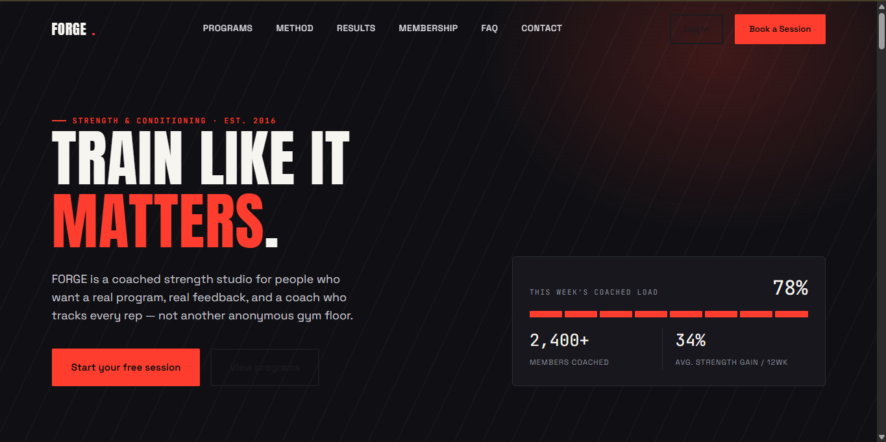
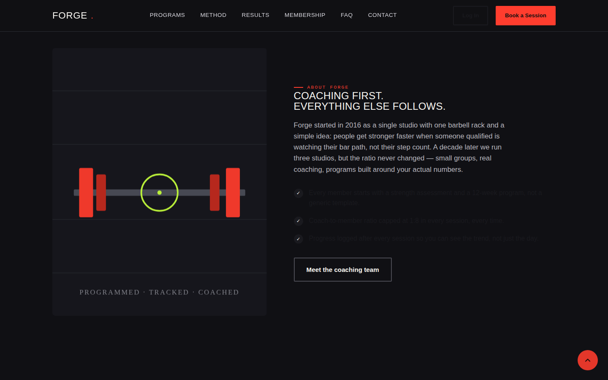
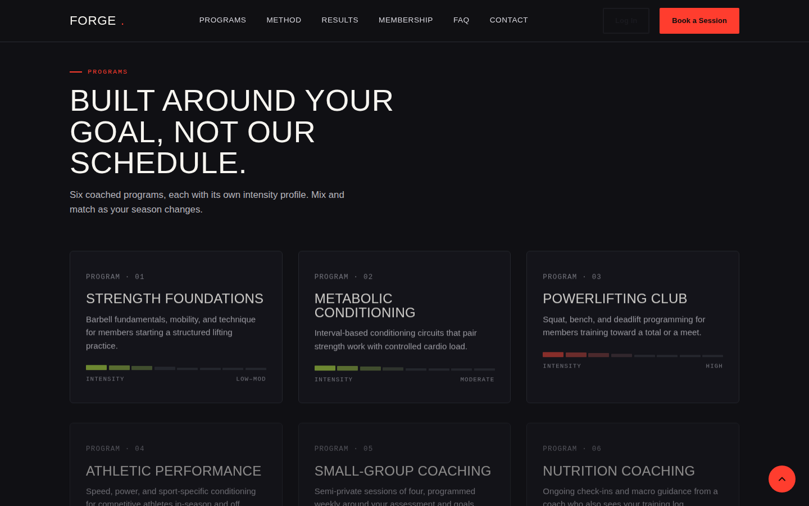
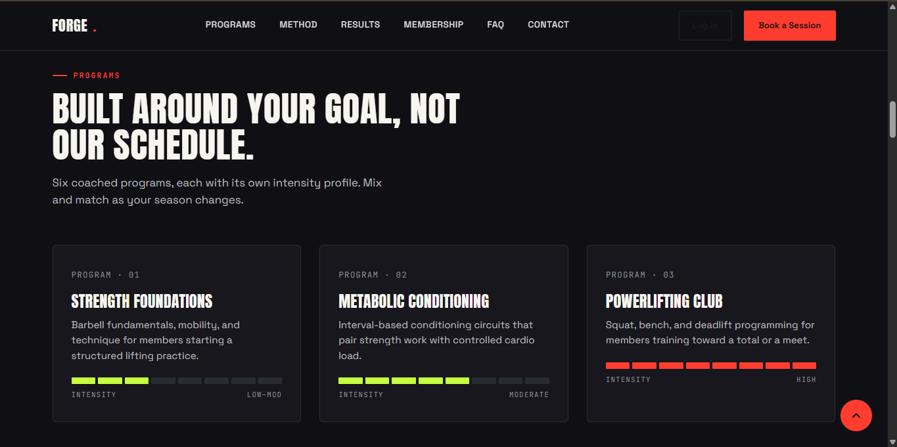
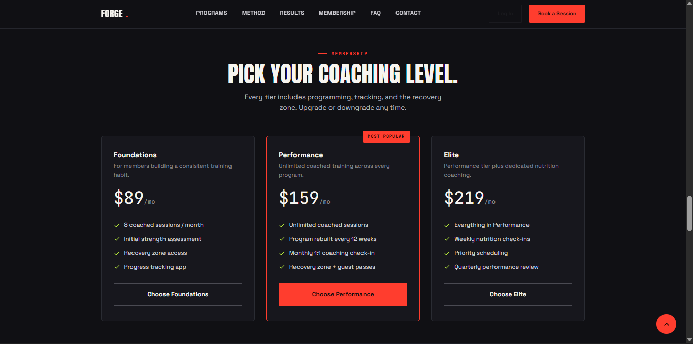
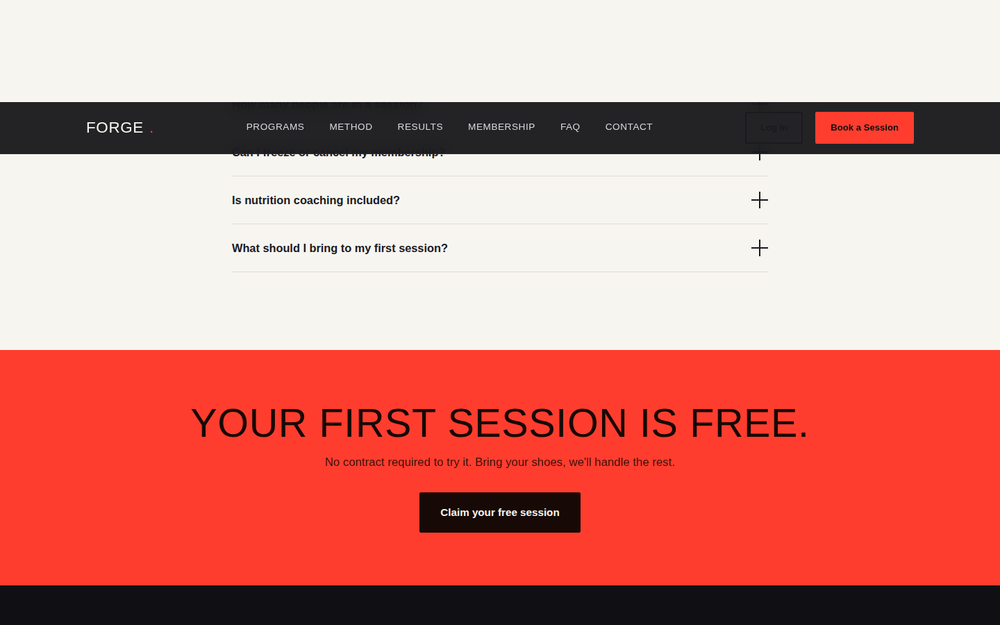

# 🏋️ FORGE Athletic Co.

A fully responsive, AI-generated marketing website for **FORGE Athletic Co.**, a fictional premium strength & conditioning studio. This project was created as part of the **Web Development Internship** to demonstrate modern web design, responsive layouts, engaging UI/UX, and interactive functionality using only HTML, CSS, and JavaScript.

---

## 🌐 Live Website

🔗 https://forge-athletic-co.vercel.app/

---

# 📸 Website Screenshots

## 🏠 Home Page



---

## 📖 About Section



---

## 🏋️ Services Section



---

## ⭐ Features Section



---

## 💳 Membership Section



---

## 📞 Contact Section



---

# 🎯 Domain Chosen

## Fitness

The **Fitness** domain was selected because it allows for a bold, energetic, and modern visual identity while naturally supporting all required website sections such as Home, About, Services, Features, Testimonials, Pricing, FAQ, and Contact.

The design focuses on motivating users through strong typography, engaging visuals, high contrast colors, and performance-driven content.

---

# 📖 About FORGE Athletic Co.

FORGE Athletic Co. is a fictional strength and conditioning studio created to showcase a professional fitness website built with AI assistance.

The website is designed for athletes, fitness enthusiasts, and individuals looking to improve their overall performance through structured coaching and evidence-based training methods.

The project demonstrates:

- Modern UI/UX principles
- Responsive web design
- Interactive user experience
- Accessibility
- Fast-loading static website
- Clean semantic HTML
- Mobile-first development

---

# 🏋️ Services

FORGE Athletic Co. offers multiple training programs designed for different fitness goals.

### 💪 Strength Coaching

Personalized strength training plans designed to increase muscle, power, and overall performance.

### ⚡ Athletic Performance

Speed, agility, endurance, mobility, and sports-specific conditioning.

### 🥗 Nutrition Coaching

Personalized nutrition guidance to support muscle growth, fat loss, and athletic performance.

### 👥 Group Training

Coach-led group workouts that build consistency, motivation, and accountability.

### 📈 Progress Tracking

Performance metrics, workout history, body measurements, and goal tracking.

---

# ✨ Features

- Fully Responsive Design
- Sticky Navigation Bar
- Mobile Navigation Menu
- Hero Landing Section
- Animated Statistics
- About Section
- Services Section
- Features Section
- Testimonials Carousel
- Pricing Cards
- FAQ Accordion
- Contact Form
- Newsletter Subscription
- Back to Top Button
- Scroll Reveal Animations
- Smooth Scrolling
- Hover Effects
- Mobile Optimized
- Semantic HTML5
- Accessible Layout

---

# 🛠 Tech Stack

- HTML5
- CSS3
- Vanilla JavaScript
- CSS Grid
- Flexbox
- CSS Custom Properties
- Google Fonts

No frameworks or external libraries were used.

---

# 🎨 Design System

### Color Palette

- Background: `#101014`
- Surface: `#18181D`
- Primary Accent: `#FF3D2E`
- Secondary Accent: `#C6FF3D`
- Text: `#F7F5F0`

### Typography

- **Anton** — Headings
- **Space Grotesk** — Body Text
- **JetBrains Mono** — Statistics & Data

---

# ⚙️ Interactivity

The website includes multiple interactive components:

- Sticky Navigation
- Animated Mobile Menu
- Smooth Anchor Navigation
- Scroll Reveal Animations
- FAQ Accordion
- Testimonial Slider
- Contact Form Validation
- Newsletter Signup
- Hover Animations
- Back-to-Top Button

---

# 📞 Contact

The Contact section allows visitors to reach the studio quickly and easily.

It includes:

- Contact Form
- Studio Address
- Phone Number
- Email Address
- Interactive Location Map
- Newsletter Subscription
- Social Media Links

---

# 📂 Project Structure

```
Website Source Code/
│
├── index.html
├── README.md
│
├── css/
│   └── style.css
│
├── js/
│   └── script.js
│
└── screenshots/
    ├── home.png
    ├── about.png
    ├── services.png
    ├── features.png
    ├── testimonials.png
    ├── pricing.png
    ├── faq.png
    └── contact.png
```

---

# 🚀 Running the Project

No installation or build process is required.

Simply open the project folder and launch **index.html** in your browser.

Or use a local development server:

```bash
python -m http.server
```

or

```bash
python3 -m http.server
```

or

```bash
npx serve .
```

Then open:

```
http://localhost:8000
```

---

# 📱 Responsive Design

The website has been optimized for:

- 💻 Desktop
- 💼 Laptop
- 📱 Mobile
- 📟 Tablet

The layout automatically adapts to different screen sizes using Flexbox, CSS Grid, and responsive media queries.

---

# 🎯 Assignment Objective

This project was created to fulfill the **AI Website Generation** internship assignment by designing and developing a complete website for a chosen domain using AI-powered development tools.

The objective was to create a visually appealing, fully responsive, and interactive website that includes multiple sections such as Home, About, Services, Features, Testimonials, Pricing, FAQ, Contact, and Footer while demonstrating modern frontend development practices.

---

# 👨‍💻 Author

**Roshan Kodi**

GitHub: https://github.com/roshankodi

Live Website: https://forge-athletic-co.vercel.app/

---

## ⭐ If you like this project, consider giving it a star on GitHub!